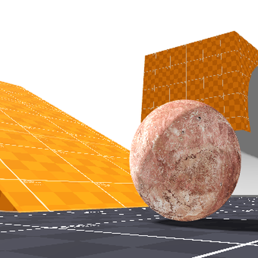
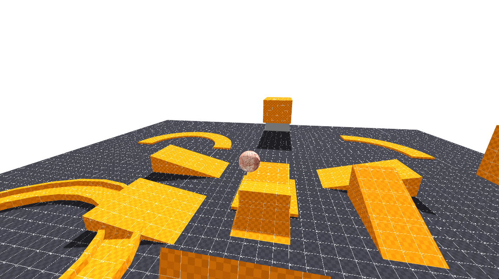
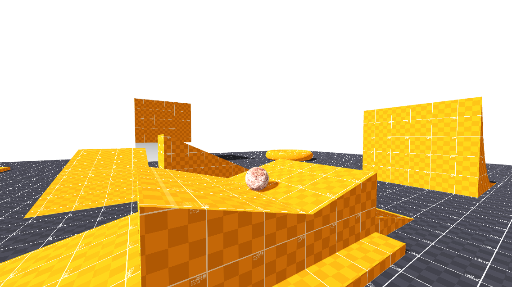

# Marble Run Controller in Godot

A `RigidBody3D` marble controller for **Godot 4**. WASD applies torque so the sphere rolls; the camera is a `SpringArm3D` that does not inherit the ball's spin.



# **Preview**




---

# **General**

This asset is a self-contained marble you can drop into a 3D scene. Steering is camera-relative torque, not `CharacterBody3D` velocity. The demo project uses **Jolt Physics**.

A graybox playground is included: ramps, a quarter-pipe, Green Hill-style loops, a circular trough, curved paths, and a torus, all on one floor.

Tune feel from the **Inspector** (`@export` / `@export_group`). No extra libraries.

# Compatibility

- **Godot 4.0 - 4.7**: Fully supported out of the box

---

# **Features**

**Marble**
- `RigidBody3D` sphere; Jolt (or Godot Physics) integrates the roll
- Camera-relative torque (`UP × move`) so the mesh rolls instead of sliding
- `@export` torque strength and max linear speed
- Continuous collision detection and sleep disabled on the demo marble

**Camera**
- `top_level` pivot so look does not inherit angular velocity
- Smoothed follow above the ball (`camera_height`, `follow_smoothing`)
- `SpringArm3D` with a small probe and margin so the arm does not eat the floor
- Mouse look with adjustable pitch limits
- Click to capture, Esc to show the cursor

**World**
- CSG graybox on one floor (Kenney prototype textures)
- Ramps facing the spawn pad, quarter-pipe, two CSG loops, circular trough, 90° / 180° curves, torus

**Developer Experience**
- Inspector groups: **Camera**, **Movement**
- Addon layout matching the other hub controllers

---

# Installation / Quickstart

## Step 1: Download or Clone

Download or clone this repository and open the project inside Godot. Enable the plugin under **Project → Project Settings → Plugins** if it is not already on.

## Step 2: Input Actions

Go to **Project → Project Settings → Input Map** and add these if they are missing:

| Input Action Name | Purpose | Key |
| --- | --- | --- |
| `move_left` | Roll left | A |
| `move_right` | Roll right | D |
| `move_forward` | Roll forward | W |
| `move_backward` | Roll backward | S |

## Step 3: Adding the Marble to Your Own Scene

1. Instance `res://addons/basic_marble_run/scenes/marble.tscn` into a 3D world.
2. Give the world collision (`CSG` with **Use Collision**, or `StaticBody3D`).
3. Select the marble and tweak the **Inspector**:
   - **Camera**:
	 - `Mouse Sensitivity`: look speed
	 - `Camera Height`: pivot height above the sphere
	 - `Follow Smoothing`: how quickly the pivot catches the ball (higher = snappier)
	 - `Pitch Min` / `Pitch Max`: vertical look limits (radians)
   - **Movement**:
	 - `Torque Strength`: how hard WASD spins the ball
	 - `Max Speed`: post-solve `|v|` cap
   - On the child **SpringArm3D**:
	 - `Spring Length`: distance behind the ball
	 - `Margin`: how far the camera stays off geometry
4. Press **F5** to run. Click the window to capture the mouse.

The packed demo is `res://addons/basic_marble_run/scenes/main.tscn`.

# **Project Structure**

```
res://
├── addons/
│   └── basic_marble_run/
│       ├── assets/
│       │   ├── 4e31caa0f5acc386e4a504eab2269ebdb47f0307.jpg
│       │   ├── GodotPrototypeBlack512.png
│       │   ├── GodotPrototypeOrange512.png
│       │   ├── icon.png
│       │   ├── preview1.png
│       │   └── preview2.png
│       ├── scenes/
│       │   ├── marble.tscn
│       │   ├── main.tscn
│       │   └── map.tscn
│       ├── scripts/
│       │   └── marble.gd
│       ├── LICENSE.txt
│       ├── README.md
│       ├── plugin.cfg
│       └── plugin.gd
├── LICENSE.txt
├── README.md
└── project.godot
```

# **Requests & Contributing**

- **Bug Reports**: Open an issue in the [Issues](../../issues) section.
- **Feature Requests**: Share ideas in the [Discussions](../../discussions) section.

# **License**

This project is open-source and available under the [MIT License](https://opensource.org/license/MIT). Free to use in personal, non-commercial, and commercial projects.

Prototype textures by Kenney are CC0.

# **Credits**

- Made by Arjun Bhumula
- Prototype textures by Kenney, available on the [Godot Asset Library](https://godotengine.org/asset-library/asset/781)
